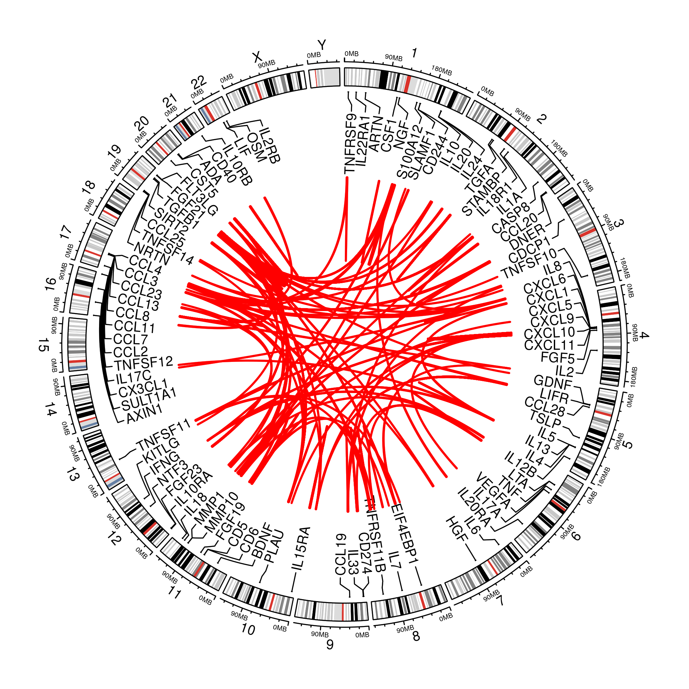
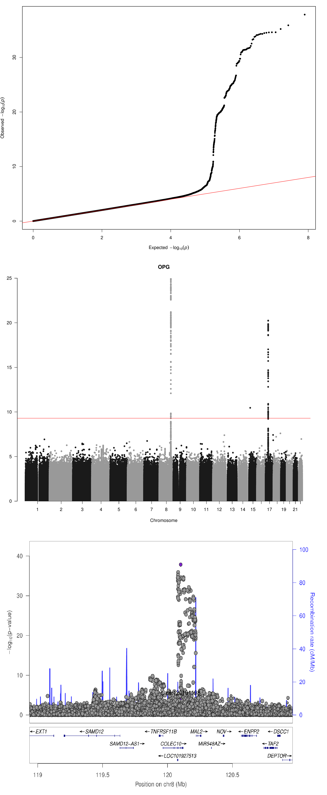

# INF
SCALLOP-INF analysis

## Installation

The repository can be downloaded locally with

``` {.bash}
git clone https://github.com/jinghua/INF
```

## A summary of files

File     | Description
---------|--------------------------------------------------------
[doc/](doc) | Some documents and auxiliary files
[tryggve/](tryggve) | Analysis programs on TRYGGVE
[SCALLOP_INF_I_analysis_plan.md](SCALLOP_INF_I_analysis_plan.md) | analysis plan
[SCALLOP_INF_I_analysis_plan.docx](SCALLOP_INF_I_analysis_plan.docx) |
[tryggve.md](tryggve.md) | TRYGGVE notes

## Analysis

To implement the analysis plan, we started with analysis on INTERVAL as with [INTERVAL.sh](tryggve/INTERVAL.sh) and [cardio.sh](doc/cardio.sh), which includes cis/trans classification via Jimmy's [cis.vs.trans.classification.R](doc/cis.vs.trans.classification.R) and a Bash version via bedtools, [cistrans.sh](doc/cistrans.sh).
Jimmy's competitive log10(p) calculator is also documented in [log10p.md](doc/log10p.md) in comparison with R/Rmpfr. The cis.vs.trans.classification and log10p functions are now both in [R/gap](https://github.com/jinghuazhao/R/tree/master/gap).



The CAD summary statistics used for MAGMA and MR is described [here](https://github.com/jinghuazhao/Omics-analysis/tree/master/CAD)
-- as noted in MMP12.sh, the MMP12 case could have been done genomewide. A colocalisation analysis on simulated data can be found in the
association analysis section of [software-notes](https://github.com/jinghuazhao/software-notes)
as well as the [BMI example](https://github.com/jinghuazhao/Omics-analysis/tree/master/BMI).



## Notes on UniProt IDs

The list of proteins on inflammation is within one of the [OLINK](https://www.olink.com/products/) panels (as in [Olink validation data all panels.xlsx](doc/Olink%20validation%20data%20all%20panels.xlsx)) each containing 92 proteins. Information contained in these panels can be retrieved into R via [OLINK.R](doc/OLINK.R), which also attempts to compromise earlier version and annotations.

The use of [UniProt](https://www.uniprot.org/) IDs is rationalised in two aspects,

1. The protein list in [inf1.csv](doc/inf1.csv) found O43508 and Q4ACW9 are associated with the TNFSF12 and TWEAK genes, respectively.

2. Q8NF90 and Q8WWJ7 were not listed at the UCSC, their availability on UniProt seem to be for backward compatibility as on query they 
point to P12034 and P30203 (Q8WWJ7_HUMAN should have been CD6_HUMAN). [hgTables.tsv](doc/hgTables.tsv) is based on UCSC, checked over
UniProt IDs as follows,
```bash
grep doc/inf1 olink.prot.list.txt | \
sed 's/inf1_//g;s/___/\t/g' > inf1.list
sort -k2,2 inf1.list > 1
awk '{
   FS=OFS="\t"; 
   split($4,f,"-");
   $4=f[1];
   if(!index($1,"_")) print
}' doc/hgTables.tsv | \
sort -k4,4 > 2
join -t$'\t' -12 -24 1 2 > 12
# 90 lines
wc -l 12
# Q8NF90 (FGF.5), Q8WWJ7 (CD6) are missing
join -v2 -22 12 1
rm 1 2 12
```
A UniProt ID may be associated with multiple chromosomes, e.g., Q6IEY1 with chromosomes 1 and 5. While [inf1.csv](doc/inf1.csv) 
edits Q4ACW9, [inf2.csv](doc/inf2.csv) is inline with UCSC with respect to P12034 and P30203.

The latest by Jimmy is [olink.inf.panel.annot.tsv](doc/olink.inf.panel.annot.tsv) from [olink.annotation.R](doc/olink.annotation.R).

## References

Folkersen L, et al. (2017). Mapping of 79 loci for 83 plasma protein biomarkers in cardiovascular disease. *PLoS Genetics* 13(4), doi.org/10.1371/journal.pgen.1006706.

Kwan JSH, et al. (2014). Meta-analysis of genome-wide association studies identifies two loci associated with circulating osteoprotegerin levels. *Hum Mol Genet* 23(24): 6684–669.

Sun BB, et al. (2018). Genomic atlas of the human plasma proteome. *Nature* 558: 73–79.
