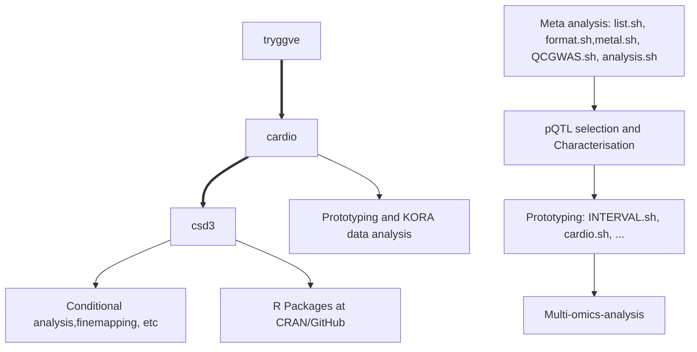

# SCALLOP-INF meta-analysis

## Flow of analysis

(view diagram by pasting script to [mermaid live editor](https://mermaid-js.github.io/mermaid-live-editor/))

Further details is available from [https://jinghuazhao.github.io/INF/](https://jinghuazhao.github.io/INF/).
