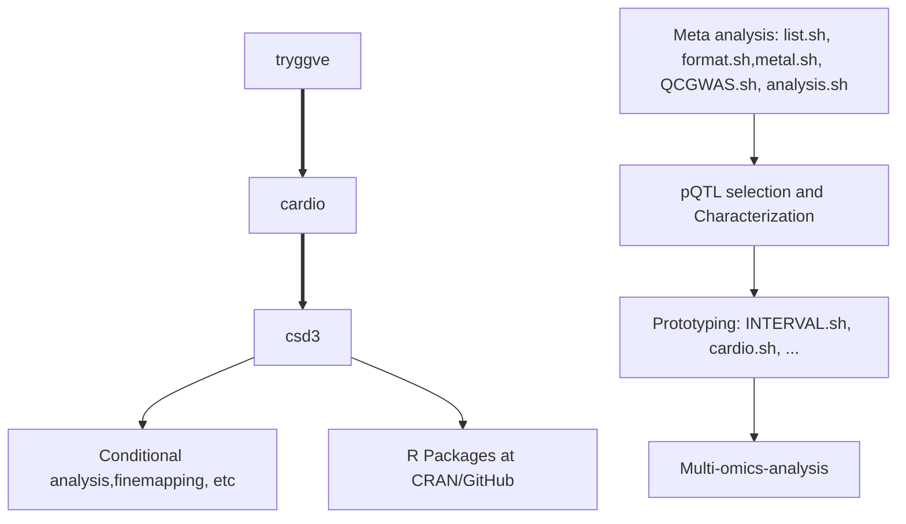
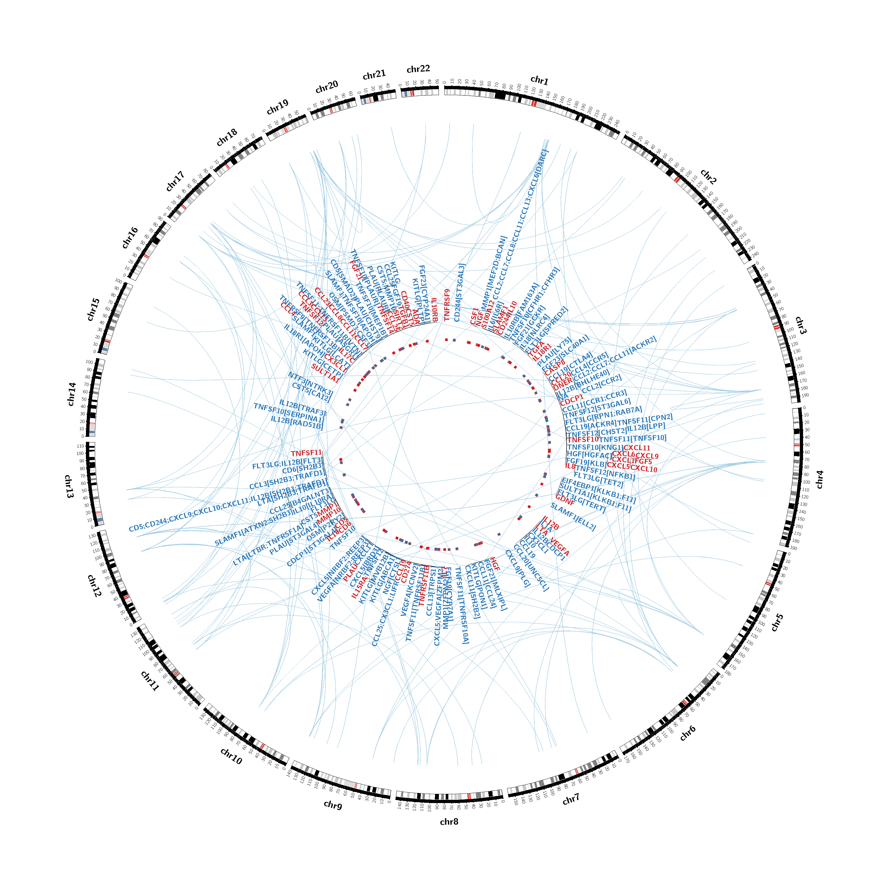

.
# SCALLOP-INF meta-analysis

A companion web site for this paper, 

The SCALLOP consortium. Jing Hua Zhao, David Stacey, Niclas Eriksson, Erin Macdonald-Dunlop, Asa H Hedman, Anette Kalnapenkis, Stefan Enroth, Domenico Cozzetto, Jonathan Digby-Bell, Jonanthan Marten, Lasse Folkersen, Christian Herder, Lina Jonsson, Sarah E. Bergen, Christian Gieger, Elise J Needham, Praveen Surendran, Estonia Biobank Research Team, Dirk S Paul, Ozren Polasek, Barbara Thorand, Harald Grallert, Michael Roden, Urmo Vosa, Tonu Esko, Caroline Hayward, Asa Johansson, Ulf Gyllensten, Nicholas Powell, Oskar Hansson, Niklas Mattsson-Carlgren, Peter K Joshi, John Danesh, Leonid Padyukov, Lars Klareskog, Mikael Landen, James F Wilson, Agneta Siegbahn, Lars Wallentin, Anders Malarstig, Adam S Butterworth, James E. Peters.
**Mapping pQTLs of circulating inflammatory proteins identifies drivers of immune-related disease risk and novel therapeutic targets**.
medRxiv 2023.03.24.23287680; doi: <https://doi.org/10.1101/2023.03.24.23287680>.

Quick links to codes for figures,

- Figure 1, [circos2.R](https://github.com/jinghuazhao/INF/blob/master/rsid/circos2.R)
- Figure 2, [rs12075.R](https://github.com/jinghuazhao/INF/blob/master/rsid/rs12075.R), [utils.sh](https://github.com/jinghuazhao/INF/blob/master/rsid/utils.sh), [IL.12B.sh](https://github.com/jinghuazhao/INF/blob/master/csd3/IL.12B.sh), [TRAIL.sh](https://github.com/jinghuazhao/INF/blob/master/csd3/TRAIL.sh)
- Figure 3, [IL.18-rs385076.sh](https://github.com/jinghuazhao/INF/blob/master/rsid/IL.18-rs385076.sh)
- Figure 4,
- Figure 5, [gsmr.r](https://github.com/jinghuazhao/INF/blob/master/workflow/scripts/gsmr.r)
- Figure 6, [utils.sh](https://github.com/jinghuazhao/INF/blob/master/rsid/utils.sh)

- Extended Data Figure 1,
- Extended Data Figure 2, [utils.sh](https://github.com/jinghuazhao/INF/blob/master/rsid/utils.sh), [IL.17C.R](https://github.com/jinghuazhao/INF/blob/master/rsid/IL.17C.R)
- Extended Data Figure 3, [aristotle.sh](https://github.com/jinghuazhao/INF/blob/master/csd3/aristotle.sh)
- Extended Data Figure 4, [h2pve.R](https://github.com/jinghuazhao/INF/blob/master/rsid/h2pve.R)
- Extended Data Figure 5, [rs12075.R](https://github.com/jinghuazhao/INF/blob/master/rsid/rs12075.R)
- Extended Data Figure 6, [utils.sh](https://github.com/jinghuazhao/INF/blob/master/rsid/utils.sh)
- Extended Data Figure 7,
- Extended Data Figure 8, [pqtlGWAS.R](https://github.com/jinghuazhao/INF/blob/master/rsid/pqtlGWAS.R)
- Extended Data Figure 9, [pqtlGWAS.R](https://github.com/jinghuazhao/INF/blob/master/rsid/pqtlGWAS.R)
- Extended Data Figure 10,[utils.sh](https://github.com/jinghuazhao/INF/blob/master/rsid/utils.sh)

- [Supplementary Figure 1](doc/manhattan-qq.pdf) (450dpi), [qqmanhattanlz.sb](https://github.com/jinghuazhao/INF/blob/master/rsid/qqmanhattanlz.sb), [utils.sh](https://github.com/jinghuazhao/INF/blob/master/rsid/utils.sh)
- [Supplementary Figure 2](doc/fp-lz.pdf), [utils.sh](https://github.com/jinghuazhao/INF/blob/master/rsid/utils.sh)
- [Supplementary Figure 3](doc/eQTLGen-INF.pdf), [eQTLGen.sh](https://github.com/jinghuazhao/INF/blob/master/rsid/eQTLGen.sh)
- [Supplementary Figure 4](doc/GWAS-INF.pdf), [coloc-disease.sh](https://github.com/jinghuazhao/INF/blob/master/rsid/coloc-disease.sh)

- Supplementary item, [js.R](https://github.com/jinghuazhao/INF/blob/master/csd3/js.R), [merge.sh](https://github.com/jinghuazhao/INF/blob/master/csd3/merge.sh)

- Supplementary Tables, [tables.R](https://github.com/jinghuazhao/INF/blob/master/rsid/tables.R)

## Flow of analysis

The diagram can also be rendered via [Mermaid live editor](https://mermaid-js.github.io/mermaid-live-editor/).

## Comments

The [tryggve](tryggve), [cardio](cardio) and [csd3](csd3) directories here are associated with the named Linux cluster(s) used for the analysis over time. Most recent implementations are documented in `Supplementary notes` ([rsid](rsid)). <b>To view the code inside the browser, select the `GitHub` button from the menu.</b>

1. Data pre-processing was done initially from tryggve with [list.sh](tryggve/list.sh) and [format.sh](tryggve/format.sh), followed by meta-analysis according to [metal.sh](tryggve/metal.sh) using METAL whose results were cross-examined with [QCGWAS.sh](tryggve/QCGWAS.sh) together with additional investigation.

2. The main analysis followed with [analysis.sh](tryggve/analysis.sh) containing codes for Manhattan/Q-Q/forest/LocusZoom plots such as the OPG example (see the diagram below), which replicated results of Kwan et al. (2014) as identified by PhenoScanner), clumping using PLINK and conditional analysis using GCTA. The clumping results were classified into cis/trans signals. As the meta-analysis stabilised especially with INTERVAL reference, analysis has been intensively done locally with cardio and csd3. cis/trans classification has been done via [cis.vs.trans.classification.R](cardio/cis.vs.trans.classification.R) as validated by [cistrans.sh](cardio/cistrans.sh).

3. We prototyped our analysis on cardio with INTERVAL such as [INTERVAL.sh](tryggve/INTERVAL.sh) and [cardio.sh](cardio/cardio.sh) as well as individual level data analysis for the KORA study. Most analyses were done locally on CSD3.

4. In alphabetical order, the `cis.vs.trans.classification`, `circos.cis.vs.trans.plot`, `cs`, `log10p`, `logp`, `gc.lambda`, `get_b_se`, `get_sdy`, `get_pve_se`, `invnormal`, `METAL_forestplot`, `mhtplot.trunc`, `mhtplot2d`, `pqtl2dplot/pqtl2dplotly/pqtl3dplotly`, `pvalue` functions are now part of R/gap at [CRAN](https://CRAN.R-project.org/package=gap) or [GitHub](https://github.com/jinghuazhao/R/). Some aspects of the downstream analyses links colocalisation and Mendelian randomisation are also available from [gap vignette](https://jinghuazhao.github.io/R/vignettes/gap.html) and [pQTLtools articles](https://jinghuazhao.github.io/pQTLtools/articles/index.html).

## The OPG example

This proves to be a positive control. The stacked image below shows Manhattan, Q-Q, forest and LocusZoom plots.

## Summary statistics

They will be available from <https://www.phpc.cam.ac.uk/ceu/proteins> and the GWAS catalog (accession GCST90270765-GCST90270855, [summary](doc/scallop-inf1.xlsx), <https://ftp.ebi.ac.uk/pub/databases/gwas/summary_statistics/GCST90270001-GCST90271000/>).

