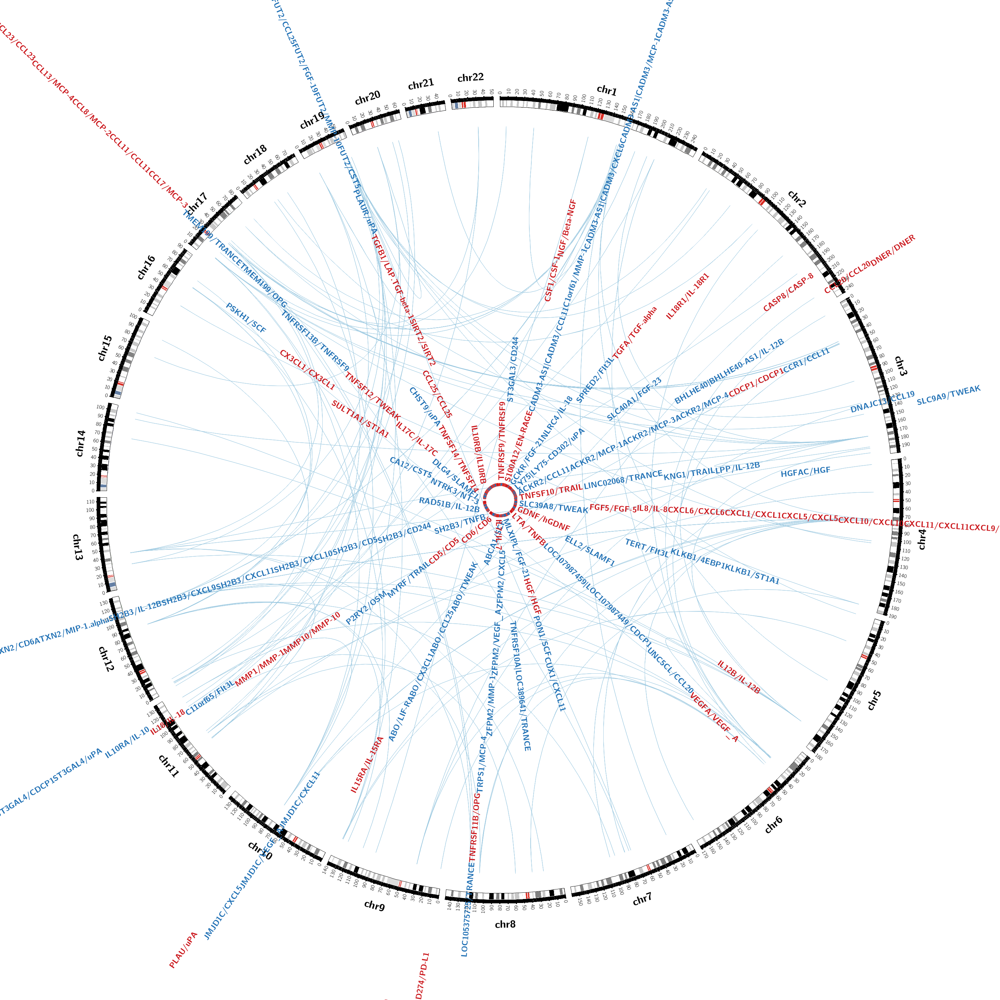
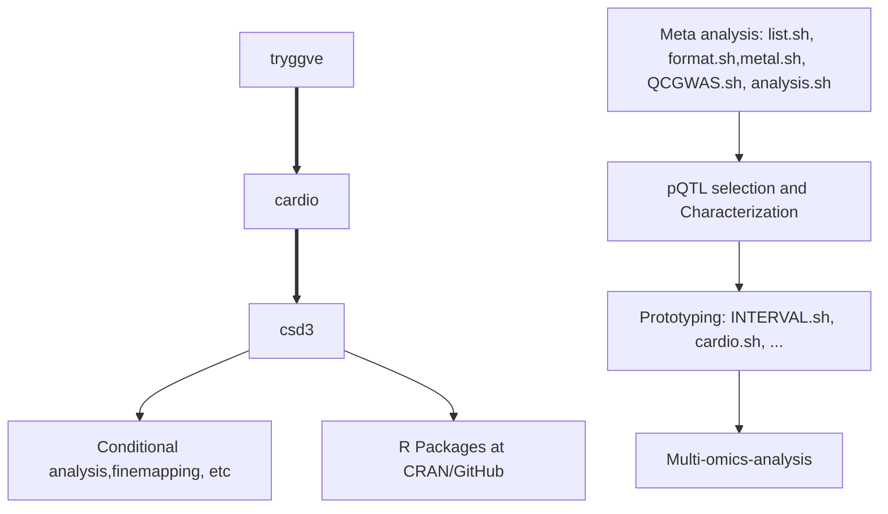
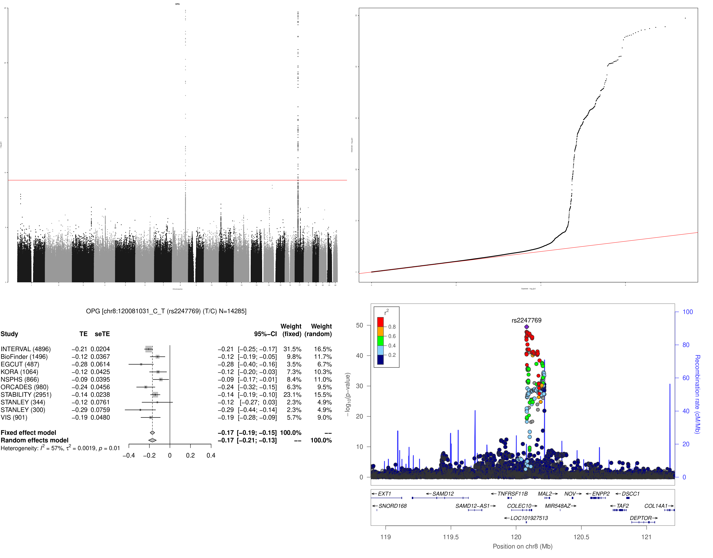

# SCALLOP-INF meta-analysis

## Flow of analysis

(When the diagram is not rendered, view it from [Mermaid live editor](https://mermaid-js.github.io/mermaid-live-editor/))

## Comments

The [tryggve](tryggve), [cardio](cardio) and [csd3](csd3) directories here are associated with the named Linux cluster(s) used for the analysis over time. Most recent implementations are documented in [Supplementary notes](rsid).

1. Data pre-processing was done initially from tryggve with [list.sh](tryggve/list.sh) and [format.sh](tryggve/format.sh), followed by meta-analysis according to [metal.sh](tryggve/metal.sh) using METAL whose results were cross-examined with [QCGWAS.sh](tryggve/QCGWAS.sh) together with additional investigation.

2. The main analysis followed with [analysis.sh](tryggve/analysis.sh) containing codes for Manhattan/Q-Q/forest/LocusZoom plots such as the OPG example (see the diagram below), which replicated results of Kwan et al. (2014) as identified by PhenoScanner), clumping using PLINK and conditional analysis using GCTA. The clumping results were classified into cis/trans signals. As the meta-analysis stabilised especially with INTERVAL reference, analysis has been intensively done locally with cardio and csd3. cis/trans classification has been done via [cis.vs.trans.classification.R](cardio/cis.vs.trans.classification.R) as validated by [cistrans.sh](cardio/cistrans.sh).

3. We prototyped our analysis on cardio with INTERVAL such as [INTERVAL.sh](tryggve/INTERVAL.sh) and [cardio.sh](cardio/cardio.sh) as well as individual level data analysis for the KORA study. Most analyses were done locally on CSD3.

4. In alphabetical order, the `cis.vs.trans.classification`, `circos.cis.vs.trans.plot`, `cs`, `log10p`, `logp`, `gc.lambda`, `get_b_se`, `get_sdy`, `get_pve_se`, `invnormal`, `METAL_forestplot`, `mhtplot.trunc`, `mhtplot2d`, `pqtl2dplot/pqtl2dplotly/pqtl3dplotly`, `pvalue` functions are now part of R/gap at [CRAN](https://CRAN.R-project.org/package=gap) or [GitHub](https://github.com/jinghuazhao/R/). Some aspects of the downstream analyses links colocalisation and Mendelian randomisation are also available from [gap vignette](https://jinghuazhao.github.io/R/vignettes/gap.html) and [pQTLtools articles](https://jinghuazhao.github.io/pQTLtools/articles/index.html).

## The OPG example

This proves to be a positive control. The stacked image below shows Manhattan, Q-Q, forest and LocusZoom plots.

## Summary statistics

The link will be added here when made available.

## Related links

* [OlinkAnalyze](https://github.com/Olink-Proteomics/OlinkRPackage)
* [Olink Insights Stat Analysis](https://tinyurl.com/shj46ukj)
* [Olink location](https://www.olink.com/scallop/), [What is NPX](https://www.olink.com/question/what-is-npx/), [F2F London meeting](https://www.olink.com/scallop-f2f-2019/), [Data Science Workshop 2019](https://www.olink.com/data-science-workshop-2019/).
* [Olink publications](https://www.olink.com/data-you-can-trust/publications/).
* [GitHub repository](https://github.com/lassefolkersen/scallop) for the 2017 *PLoS Genetics* paper.
* [SCALLOP consortium](http://www.scallop-consortium.com/) ([securecloud](https://secureremote.dtu.dk/vpn/index.html)).

---

* [Aging Plasma Proteome](https://twc-stanford.shinyapps.io/aging_plasma_proteome/) ([DEswan](https://github.com/lehallib/DEswan)).
* [Bgee](https://bgee.org/).
* [Computed structures of core eukaryotic protein complexes](https://modelarchive.org/doi/10.5452/ma-bak-cepc)
* [ImmunoBase](https://genetics.opentargets.org/immunobase).
* [IntAct](https://www.ebi.ac.uk/intact/home).
* [SomaLogic plasma protein GWAS summary statistics](http://www.phpc.cam.ac.uk/ceu/proteins).
* [The human protein atlas](https://www.proteinatlas.org/)
* [Worldwide PDB](http://www.wwpdb.org/)

## References

Choi SW, Mak TS, O'Reilly PF Tutorial: a guide to performing polygenic risk score analyses. *Nat Protoc* 15, 2759-2772 (2020), [GitHub](https://github.com/choishingwan/PRSice) [documentation](https://choishingwan.github.io/PRS-Tutorial/).

Folkersen L, et al. (2017). Mapping of 79 loci for 83 plasma protein biomarkers in cardiovascular disease. *PLoS Genetics* 13(4), doi.org/10.1371/journal.pgen.1006706.

Kwan JSH, et al. (2014). Meta-analysis of genome-wide association studies identifies two loci associated with circulating osteoprotegerin levels. *Hum Mol Genet* 23(24): 6684–6693.

Niewczas MA, et al. (2019). A signature of circulating inflammatory proteins and development of end-stage renal disease in diabetes. *Nat Med*. https://doi.org/10.1038/s41591-019-0415-5

Sun BB, et al. (2018). Genomic atlas of the human plasma proteome. *Nature* 558: 73–79.
