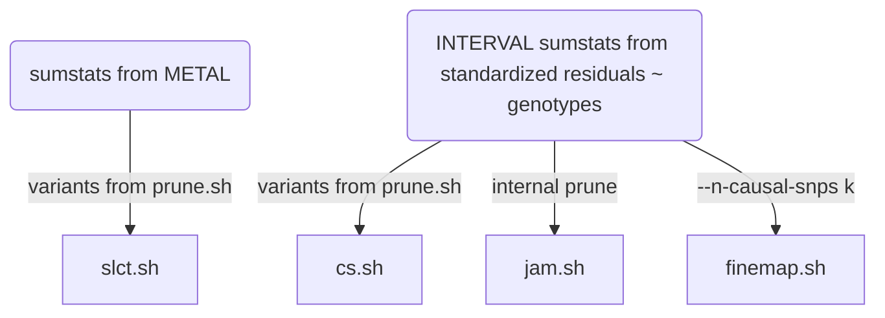

# Notes

## UniProt IDs

The list of proteins on inflammation is within one of the [Olink](https://www.olink.com/products/) panels (as in [Olink validation data all panels.xlsx](../doc/Olink%20validation%20data%20all%20panels.xlsx)) each containing 92 proteins. Information contained in these panels can be retrieved into R via [Olink.R](../doc/Olink.R), which also attempts to compromise earlier version and annotations. Nevertheless O43508 is replaced with Q4ACW9 for TWEAK.

BDNF has recently been removed from the assay and replaced with CD8A, [https://www.olink.com/bdnf-info/](https://www.olink.com/bdnf-info/), and there are also changes on TNF and IFN.gamma, [https://www.olink.com/inflammation-upgrade/](https://www.olink.com/inflammation-upgrade/).

A [UniProt](https://www.uniprot.org/) ID may be associated with multiple chromosomes, e.g., Q6IEY1 with chromosomes 1 and 5. While [inf1.csv](../doc/inf1.csv) 
edits Q4ACW9, [inf2.csv](../doc/inf2.csv) is inline with UCSC with respect to P12034 and P30203.

The use of uniprot IDs is noted in two aspects,

1. The protein list in [inf1.csv](../doc/inf1.csv) notes both O43508 and Q4ACW9.

2. Q8NF90 and Q8WWJ7 were not listed at the UCSC, their availability on UniProt seem to be for backward compatibility as on query they 
point to P12034 and P30203 (Q8WWJ7_HUMAN should have been CD6_HUMAN). [hgTables.tsv](../doc/hgTables.tsv) is based on UCSC, checked over
UniProt IDs as follows,
```bash
grep inf1 doc/olink.prot.list.txt | \
sed 's/inf1_//g;s/___/\t/g' > inf1.list
join -t$'\t' -12 -24 \
     <(sort -k2,2 inf1.list) \
     <(awk '{split($4,f,"-"); $4=f[1]; if(!index($1,"_")) print}' OFS='\t' doc/hgTables.tsv | sort -k4,4) \
     > 12
# 90 lines
wc -l 12
# Q8NF90 (FGF.5), Q8WWJ7 (CD6) are missing
join -v2 -22 12 <(sort -k2,2 inf1.list)
rm 12
```
Likewise, [olink.inf.panel.annot.tsv](../doc/olink.inf.panel.annot.tsv) from [olink.annotation.R](../doc/olink.annotation.R) also has the following two entries

"target" | "target.short" | "uniprot" | "panel" | "prot.on.multiple.panel" | "panels.with.prot" | "hgnc_symbol" | ...
---------|----------------|-----------|---------|--------------------------|--------------------|---------------|----
"Fibroblast growth factor 5 (FGF-5)" | "FGF-5" | "Q8NF90" | "inf" | FALSE | NA | NA
"T-cell surface glycoprotein CD6 isoform (CD6)" | "CD6" | "Q8WWJ7" | "inf" | FALSE | NA | NA

whose hgnc_symbol can be amended.


The overlap with SomaLogic panel is characterised with [Olink.R](../doc/Olink.R) which also gives a Venn diagram.

## Joint/conditional analysis and fine-mapping

The INTERVAL data is used as reference panel. The logic of this specific directory is a simple solution of the dilemma that the reference data, possibly like others, uses reference sequence ID (rsid) whenever possible. However, during meta-analysis the practice of using rsids is undesirable so SNPID, i.e., chr:pos_A1_A2, (A1<=A2) is necessary.

After a rather long and laborious process involving many software, it turned out a simple way out is to obtain sentinels using SNPID but return to rsids at this stage and forward. The implementation here reflects this. The file INTERVAL.rsid contains SNPID-rsid mapping and could be generated from programs such as `qctool/bgenix/plink`. A related file is `snp_pos` containing rsid -- chr:pos mappings; for instance this could be built from dbSNP.

A note on regions is ready. It is attractive to use the last genomic region from iterative merging for analysis and perhaps a flanking version. This is more appropriate than genome-wide hard and fast 10MB windows or approximately independent LD blocks. For the latter, we found that the boundaries from the distributed 1000Genomes project were often inappropriate and one may not attempt to compute them for specific reference panel. Nevertheless, the iterative procedure actually just does empirically. Again the HLA region is condensed.

The last point regards software `finemap`, which uses summary statistics associated with the reference panel rather than that from meta-analysis.

File | Description
-----|------------------------------
NLRP2.sh | the exclusion list
cs.sh | Credible sets
ma.sh | INF1 sumstats
INTERVAL-ma.sh | INTERVAL sumstats
prune.sh | pruning
slct.sh  | GCTA --cojo-slct analysis
finemap.sh | `finemap` analysis
jam.sh | `JAM` analysis
st.sh | batch command file
cs/, finemap/, jam/, prune/, work/ | working directories

**Steps**

`st.sh` conceptually executes the following elements,



Note that the `GCTA` .ma, jma.cojo, .ldr.cojo become -rsid.ma, -rsid.jma.cojo, -rsid.ldr.cojo, respectively; the same are true for files related to `finemap`.

## HGI analysis

File | Description
-----|-----------------
HGI.sh, HGI.R | pQTLMR
gsmr_HGI.sb, gsmr_HGI.sh | GSMR
gsmr.sh, gsmr.R | GSMR
rs635634.sh |  +/- 1Mb

## Miscellaneous analyses and utilities

File | Description
-----|---------------------------
chembl.sh | toy CHEMBL queries
CRP.sh | an inflammation score
cvd1.sh | SCALLOP-CVDI supplementary tables
coloc.sb | coloc analysis -- clumsy verion
coloc.R | coloc analysis via pQTLtools
efo.R | experimental factor ontology
eQTL.R | cis-pQTL eQTL lookup (PhenoScanner)
fastenloc.sb | fastenloc analysis
fusion_twas.sb | FUSION TWAS experiment
garfield.sh | GARFIELD analysis
gdigt.R | GDI and gene-trials
gsmr.sh | GSMR processing
GTEx.R | cis-pQTL GTEx eQTL lookup (PhenoScanner)
GTEx.sh | cis-pQTL GTEx eQTL lookup (GTEx v8)
gwasvcf.sh | GWAS to VCF conversion
gwas2vcf.sb | gwas2vcf + VCF operations
hyprcoloc.sh | hyprcoloc analysis
h2pve.R | h2/pve contrast
HGI.sh | HGI data analysis
latex.tex | LaTeX formulas embedded in Markdown
latex.docx | LaTeX formulas embedded in MicroSoft Word
LTBR.sh | LTBR LocusZoom plots
magma.sh | MAGMA for IL.12B
neale.sh | signal selection for Neale UKB data (HbA1c)
pleiotropy.R | horizontal and vertical pleiotropy
ppi.R | PPI using EpiGraphDB
pqtlGWAS.R | pQTL-GWAS lookup
pQTL.R | pQTL lookup
pqtlMR.sh | pQTL MR analysis
rentrez.sh | reuse of rentrez
rGREAT.R | GREAT analysis
stringdb.sh | STRINGdb
tables.R | code to create Excel Tables
uniprot.R | UniProt IDs to others
utils.sh | utilties
vep.sh | VEP annotation
wgcna.sh | experiment on modules

## Stacked association plots

1. IL.18-rs385076.sh
2. rs12075.sh
3. TNFB-rs2364485.sh
4. MS.sh (two-sample MRs)
5. OPG-TRANCE.sh

## Nested PGS model


Without loss of generality, we have genotype data G1, G2, G3, which link with proteins P1, P2, P3 as predictors for outcome y.

The figure is obtained with

```bash
dot -Tpng grViz.gv -ogrViz.png
```
which also be  obtained from RStudio for somewhat larger size.

## Mathematical expressions

PVE=$\sum_{i=1}^T{\frac{\chi_i^2}{N_i-2+\chi_i^2}}$

$SE_{PVE}=\sum_{i=1}^T{\frac{1}{N_i-1}}$

The prior probability for i out of m variants is causal, is obtained as a binomial probability

$p_i=\sum_{i=1}^k{m\choose{i}}{\left(\frac{i}{m}\right)^i\left(1-\frac{i}{m}\right)^{m-i}}$

The posterior number of causal signals in the genomic region is obtained as the expectation ∑i Pi|data × i. The search of total number of configurations

$\sum_{i=1}^k{m\choose{i}}$

The GREAT Binomial test is

$\sum_{i=k_\pi}^n{n\choose{i}}p_\pi^i(1-p_\pi)^{n-i}$

Transcriptomewide association statistic $z_{TWAS}$ was originally proposed for gene expression data. For a given Trait of interest **T** for which GWAS summary statistics $z_T$ is available, the corresponding Wald statistic for TWAS is defined such that

$z_{TWAS} = \frac{w^T_{P}z_T}{\sqrt{w^T_{P}Vw_{P}}}$

where $w_{P}$ is a weight associated with protein abundance level and **V** covariance matrix for $z_T$, respectively.

*Date last changed:* **26/6/2021**
