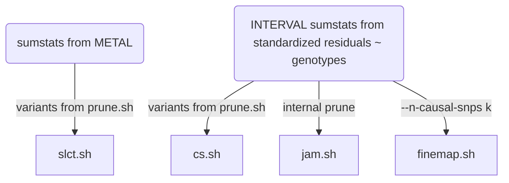
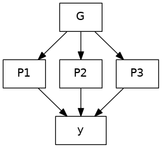
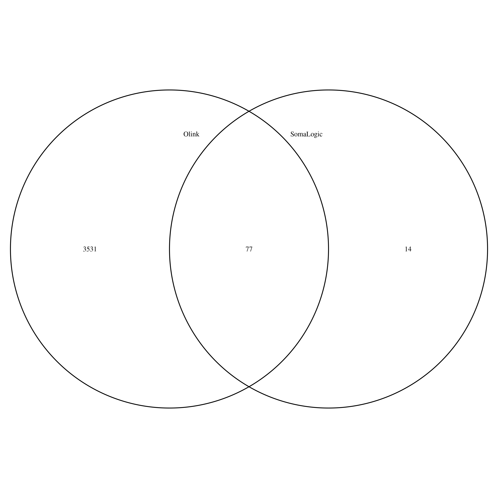

# Notes

## Joint/conditional analysis and fine-mapping

The INTERVAL data is used as reference panel. The logic of this specific directory is a simple solution of the dilemma that the reference data, possibly like others, uses reference sequence ID (rsid) whenever possible. However, during meta-analysis the practice of using rsids is undesirable so SNPID, i.e., chr:pos_A1_A2, (A1<=A2) is necessary.

After a rather long and laborious process involving many software, it turned out a simple way out is to obtain sentinels using SNPID but return to rsids at this stage and forward. The implementation here reflects this. The file INTERVAL.rsid contains SNPID-rsid mapping and could be generated from programs such as `qctool/bgenix/plink`. A related file is `snp_pos` containing rsid -- chr:pos mappings; for instance this could be built from dbSNP.

A note on regions is ready. It is attractive to use the last genomic region from iterative merging for analysis and perhaps a flanking version. This is more appropriate than genome-wide hard and fast 10MB windows or approximately independent LD blocks. For the latter, we found that the boundaries from the distributed 1000Genomes project were often inappropriate and one may not attempt to compute them for specific reference panel. Nevertheless, the iterative procedure actually just does empirically. Again the HLA region is condensed.

The last point regards software `finemap`, which uses summary statistics associated with the reference panel rather than that from meta-analysis.

File | Description
-----|------------------------------
NLRP2.sh | the exclusion list
cs.sh | Credible sets
ma.sh | INF1 sumstats
INTERVAL-ma.sh | INTERVAL sumstats
prune.sh | pruning
slct.sh  | GCTA --cojo-slct analysis
finemap.sh | `finemap` analysis
jam.sh | `JAM` analysis
st.sh | batch command file
cs/, finemap/, jam/, prune/, work/ | working directories

**Steps**

`st.sh` conceptually executes the following elements,



Note that the `GCTA` .ma, jma.cojo, .ldr.cojo become -rsid.ma, -rsid.jma.cojo, -rsid.ldr.cojo, respectively; the same are true for files related to `finemap`.

## Mendelian Randomization (MR) analysis

There has been a major overhaul by refocusing on cis-pQTLs using GSMR involving both immune-mediated traits and COVID outcomes. These have been implemented in `mr.sh` and `mr.sb`. To get around the mishap with rsids we switched back to SNPids; we found the options `--clump-r2 0.1 --gsmr-snp-min 10` make more sense for instance with IL-12B it would retain the sentinel and also the significant MR results on inflammatory bowel disease. Earlier we coded specifically for HGI analysis, in particular aiming for four test statistics and better quality graphics.

It turned to be more efficient in cis-pQTL analyses to extract the relevant variants involving in the analysis, rather than using whole-genome reference files. This led to ref/, prot/, /trait directories for reference, protein and trait data, respectively.

The GSMR implementation started with CAD/FEV1 (now with `gsmr.sh`, `gsmr.sb`, `gsmr.R`) and then HGI as `gsmr_HGI.*` and pQTLMR/MR (`HGI.sh`, `HGI.R`), and +/- 1MB (`rs635634.sh`).

Earlier on, a pQTL-based MR analysis is furnished with `pqtlMR.sh`.

## Variant annotation

This is exemplified with `vep.sh`. GARFIELD analysis is furnsihed with `garfield.sh`. Specific and collective enrichment can be found in `magma.sh` and `rGREAT.R`.

## Colocalization analysis

eQTL lookup is done with PhenoScanner via `eQTL.R`, `eQTLGen.sh` and GTEx via `GTEx-ps.R`, `GTEx-ps.sh` and `GTEx-ps-jma.sh`.

Credible set lookup from GTEx v8 is furnished with `GTEx-cs.sh` and `GTEx-cs-jma.sh`.

Eearlier experiments were done with `coloc.sb` (clumsy) and `coloc.R` (with pQTLtools) as well as `fastenloc.sb`.

Multitrait counterparts were also done with HyPrColoc as in `rs12075.sh` and `LTBR.sh`.

## Generation of summary statistics

This is implemented with `gwasvcf.sh` and `gwas2vcf.sb` which includes some operations on VCF files. However, we found there is loss of information if enforcing use of RSid.

## Mathematical expressions

We first make some preparations.

Let $\mbox{x} = SNP\ dosage$. Note that $\mbox{Var}(\mbox{x})=2f(1-f)$, $f=MAF$ or $1-MAF$ by symmetry.

Our linear regression model is $\mbox{y}=a + b\mbox{x} + e$. We have $\mbox{Var}(\mbox{y}) = b^2\mbox{Var}(\mbox{x}) + \mbox{Var}(e)$. Moreover, $\mbox{Var}(b)=\mbox{Var}(e)/S_\mbox{xx}$, we have $\mbox{Var}(e) = \mbox{Var}(b)S_\mbox{xx} = N \mbox{Var}(b) \mbox{Var}(\mbox{x})$.

We also need some established results of a ratio (R/S), i.e., the mean

$$
\begin{align}
E(R/S) \approx \frac{\mu_R}{\mu_S}-\frac{\mbox{Cov}(R,S)}{\mu_S^2}+\frac{\mbox{Var}(S)\mu_R}{\mu_S^3} \hspace{100cm} 
\end{align}
$$

and more importantly the variance

$$
\begin{align}
\mbox{Var}(R/S) \approx \frac{\mu_R^2}{\mu_S^2} \left[
                        \frac{\sigma_R^2}{\mu_R^2} -2\frac{\mbox{Cov}(R,S)}{\mu_R\;\mu_S}
                       +\frac{\sigma_S^2}{\mu_S^2} \right] \hspace{100cm}
\end{align}
$$

where $\mu_R$, $\mu_S$, $\sigma_R^2$, $\sigma_S^2$ are the means and variances, respectively.

Finally, we need expectation and variance of $\chi_1^2$, $\chi^2$ distribution of one degree of freedom, which is 1 and 2, respectively.

We now state our results.

1.  The proportion of variants explained (PVE).

    From above $PVE = \frac{\mbox{Var}(b\mbox{x})}{\mbox{Var}(\mbox{y})} = \frac{b^22f(1-f)}{2f(1-f)b^2+2Nf(1-f)\mbox{Var}(b)}$. In fact, let $z = \frac{b}{SE(b)}$, $PVE = \frac{\mbox{z}^2}{\mbox{z}^2+N}$.

    On the other hand, also better known as `the coefficient of determination` for a simple linear regression is also the square of Pearson correlation coefficient ($r$), which is readily from the $t$-statistic of the regression slope, i.e., $r=\frac{t}{\sqrt{t^2+N-2}}$. so

    PVE = $\frac{\chi^2}{N-2+\chi^2}$

    The standard errors of both forms can be obtained via variance of a ratio (R/S). By $z\sim \chi_1^2$, all the elements are listed in a table below.

    Linear regression | $t$-statistic
    ------------------|--------------
    $\mu_R=1$         | $\mu_R=1$
    $\sigma_R^2=2$    | $\sigma_R^2=2$
    $\mu_S=N+1$       | $\mu_S=N-1$
    $\sigma_S^2=N+2$    | $\sigma_S^2=N$
    $\mbox{Cov}(R,S)=2$ | $\mbox{Cov}(R,S)=2$

    the variances are approximately $\frac{2}{(N+1)^2}$ and $\frac{2}{(N-1)^2}$, respectively.

    For $T$ independent pQTLs for a protein from meta-analytic statistics PVE is approximated with

    PVE = $\sum_{i=1}^T{\frac{\chi_i^2}{N_i-2+\chi_i^2}}$

    and its standard error is obtained similarly.

2.  To recover the effect size ($b$) and its standard error ($se$) from allele frequency ($f$), sample size ($n$) and $z$-statistic ($z$) as in cis eQTLGen data, we have

    $$
    \begin{align}
    b & = z/d \hspace{100cm} \\ 
    se & = 1/d
    \end{align}
    $$

    where $d = \sqrt{2f(1-f)(n+z^2)}$.

3. The prior probability for $i$ out of $m$ variants is causal, is obtained as a binomial probability

    $p(i)={m\choose{i}}{\left(\frac{i}{m}\right)^i\left(1-\frac{i}{m}\right)^{m-i}}$

    The posterior number of causal signals in the genomic region is obtained as the expectation $\sum_i p(i|\mbox{data}) \times i$. The search of total number of configurations

    $\sum_{i=1}^k{m\choose{i}}$

4. The GREAT Binomial test is

    $\sum_{i=k_\pi}^n{n\choose{i}}p_\pi^i(1-p_\pi)^{n-i}$

5. A proteome-wide analogy $z_{PWAS}$ is made to (transcriptome)wide association statistic originally proposed for gene expression data. For a given Protein of interest **P** for which GWAS summary statistics $z_P$ is available, the corresponding Wald statistic for PWAS is defined such that

    $z_{PWAS} = \frac{w^T_{P}z_P}{\sqrt{w^T_{P}Vw_{P}}}$

    where $w_{P}$ is a weight associated with protein abundance level and **V** covariance matrix for $z_P$, respectively.

## Nested PGS model

<p align="center"></p>

Without loss of generality, we have genotype data G, which link with proteins P1, P2, P3 as predictors for outcome y.

The figure is obtained with

```bash
dot -Tpng grViz.gv -ogrViz.png
```
which also be  obtained from RStudio for somewhat larger size.

---

## Auxiliary files

File | Description
-----|---------------------------
chembl.sh | toy CHEMBL queries
CRP.sh | an inflammation score
cvd1.sh | SCALLOP-CVDI supplementary tables
circos.* | circos/circlize scripts
efo.R | experimental factor ontology
epigraphdb-pleiotropy.R | horizontal and vertical pleiotropy
epigraphdb-ppi.R | PPI using EpiGraphDB
fusion_twas.sb | FUSION TWAS experiment
gdigt.R | GDI and gene-trials
GREP.sh | GREP script
h2pve.R | h2/pve contrast
inbio-discover.R | gene lists
neale.sh | signal selection for Neale UKB data (HbA1c)
OpenGWAS.sh | OpenGWAS download
pheweb.Rmd | Data extraction from pheweb.jp
pqtlGWAS.R | pQTL-GWAS lookup
pQTL.R | pQTL lookup
qqman.sb | Q-Q/Manhattan plots under CSD3
rentrez.sh | reuse of rentrez
Somascan-Olink.* | Somascan/Olink overlap
stringdb.sh | STRINGdb
tables.R | code to create Excel Tables
uniprot.R | UniProt IDs to others
utils.sh | utilties
wgcna.sh | experiment on modules

### Stacked association and related analysis

1. rs12075.sh
2. MS.sh (+cojo, two-sample MRs)+LTBR.sh (stack_assoc_plot + HyPrColoc/PWCoCo)
3. IL.18-rs385076.sh
4. OPG-TRANCE.sh

and `MS.sh` contains a routine to generate tabix-indexed blood cell traits.

### UniProt IDs

The list of proteins on inflammation is within one of the [Olink](https://www.olink.com/products/) panels (as in [Olink validation data all panels.xlsx](../doc/Olink%20validation%20data%20all%20panels.xlsx)) each containing 92 proteins. Information contained in these panels can be retrieved into R via [Olink.R](../doc/Olink.R), which also attempts to compromise earlier version and annotations. Nevertheless O43508 is replaced with Q4ACW9 for TWEAK.

BDNF has recently been removed from the assay and replaced with CD8A, [https://www.olink.com/bdnf-info/](https://www.olink.com/bdnf-info/), and there are also changes on TNF and IFN.gamma, [https://www.olink.com/inflammation-upgrade/](https://www.olink.com/inflammation-upgrade/).

A [UniProt](https://www.uniprot.org/) ID may be associated with multiple chromosomes, e.g., Q6IEY1 with chromosomes 1 and 5. While [inf1.csv](../doc/inf1.csv) 
edits Q4ACW9, [inf2.csv](../doc/inf2.csv) is inline with UCSC with respect to P12034 and P30203.

The use of uniprot IDs is noted in two aspects,

1. The protein list in [inf1.csv](../doc/inf1.csv) notes both O43508 and Q4ACW9.

2. Q8NF90 and Q8WWJ7 were not listed at the UCSC, their availability on UniProt seem to be for backward compatibility as on query they 
point to P12034 and P30203 (Q8WWJ7_HUMAN should have been CD6_HUMAN). [hgTables.tsv](../doc/hgTables.tsv) is based on UCSC, checked over
UniProt IDs as follows,
```bash
grep inf1 doc/olink.prot.list.txt | \
sed 's/inf1_//g;s/___/\t/g' > inf1.list
join -t$'\t' -12 -24 \
     <(sort -k2,2 inf1.list) \
     <(awk '{split($4,f,"-"); $4=f[1]; if(!index($1,"_")) print}' OFS='\t' doc/hgTables.tsv | sort -k4,4) \
     > 12
# 90 lines
wc -l 12
# Q8NF90 (FGF.5), Q8WWJ7 (CD6) are missing
join -v2 -22 12 <(sort -k2,2 inf1.list)
rm 12
```
Likewise, [olink.inf.panel.annot.tsv](../doc/olink.inf.panel.annot.tsv) from [olink.annotation.R](../doc/olink.annotation.R) also has the following two entries

"target" | "target.short" | "uniprot" | "panel" | "prot.on.multiple.panel" | "panels.with.prot" | "hgnc_symbol" | ...
---------|----------------|-----------|---------|--------------------------|--------------------|---------------|----
"Fibroblast growth factor 5 (FGF-5)" | "FGF-5" | "Q8NF90" | "inf" | FALSE | NA | NA
"T-cell surface glycoprotein CD6 isoform (CD6)" | "CD6" | "Q8WWJ7" | "inf" | FALSE | NA | NA

whose hgnc_symbol can be amended.



The overlap with SomaLogic panel is characterised with [Olink.R](../doc/Olink.R) which also gives a Venn diagram.

*Date last changed:* **4/11/2021**
