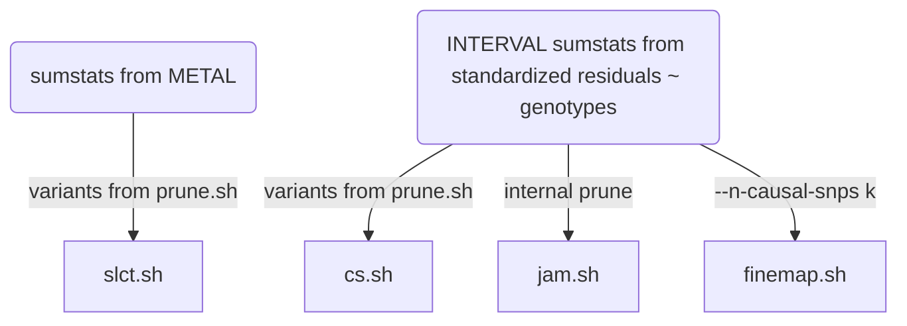

## Joint/conditional analysis and fine-mapping

The INTERVAL data is used as reference panel. The logic of this specific directory is a simple solution of the dilemma that the reference data, possibly like others, uses reference sequence ID (rsid) whenever possible. However, during meta-analysis the practice of using rsids is undesirable so SNPID, i.e., chr:pos_A1_A2, (A1<=A2) is necessary.

After a rather long and laborious process involving many software, it turned out a simple way out is to obtain sentinels using SNPID but return to rsids at this stage and forward. The implementation here reflects this. The file INTERVAL.rsid contains SNPID-rsid mapping and could be generated from programs such as `qctool/bgenix/plink`. A related file is `snp_pos` containing rsid -- chr:pos mappings; for instance this could be built from dbSNP.

A note on regions is ready. It is attractive to use the last genomic region from iterative merging for analysis and perhaps a flanking version. This is more appropriate than genome-wide hard and fast 10MB windows or approximately independent LD blocks. For the latter, we found that the boundaries from the distributed 1000Genomes project were often inappropriate and one may not attempt to compute them for specific reference panel. Nevertheless, the iterative procedure actually just does empirically. Again the HLA region is condensed.

The last point regards software `finemap`, which uses summary statistics associated with the reference panel rather than that from meta-analysis.

### Main analyses

File | Description
-----|------------------------------
NLRP2.sh | the exclusion list
cs.sh | Credible sets
ma.sh | INF1 sumstats
INTERVAL-ma.sh | INTERVAL sumstats
prune.sh | pruning
slct.sh  | GCTA --cojo-slct analysis
finemap.sh | `finemap` analysis
jam.sh | `JAM` analysis
coloc.sb | coloc analysis -- clumsy verion
coloc.R | coloc analysis via pQTLtools
fastenloc.sb | fastenloc analysis
fusion_twas.sb | FUSION TWAS experiment
garfield.sh | GARFIELD analysis
gsmr.sh | GSMR processing
hyprcoloc.sh | hyprcoloc analysis
st.sh | batch command file
cs/, finemap/, jam/, prune/, work/ | working directories

**Steps**

`st.sh` conceptually executes the following elements,



Note that the `GCTA` .ma, jma.cojo, .ldr.cojo become -rsid.ma, -rsid.jma.cojo, -rsid.ldr.cojo, respectively; the same are true for files related to `finemap`.

### HGI analysis

File | Description
-----|-----------------
HGI.sh, HGI.R | pQTLMR
gsmr_HGI.sb, gsmr_HGI.sh | GSMR
gsmr.sh, gsmr.R | GSMR
rs635634.sh |  +/- 1Mb

### Miscellaneous analyses and utilities

File | Description
-----|---------------------------
chembl.sh | toy CHEMBL queries
CRP.sh | an inflammation score
cvd1.sh | SCALLOP-CVDI supplementary tables
efo.R | experimental factor ontology
eQTL.R | cis-pQTL eQTL lookup (PhenoScanner)
GTEx.R | cis-pQTL GTEx eQTL lookup (PhenoScanner)
GTEx.sh | cis-pQTL GTEx eQTL lookup (GTEx v8)
gdigt.R | GDI and gene-trials
gwasvcf.sh | GWAS to VCF conversion
gwas2vcf.sb | gwas2vcf + VCF operations
h2pve.R | h2/pve contrast
HGI.sh | HGI data analysis
latex.tex | LaTeX formulas embedded in Markdown
latex.docx | LaTeX formulas embedded in MicroSoft Word
LTBR.sh | LTBR LocusZoom plots
magma.sh | MAGMA for IL.12B
neale.sh | signal selection for Neale UKB data (HbA1c)
pleiotropy.R | horizontal and vertical pleiotropy
ppi.R | PPI using EpiGraphDB
pqtlGWAS.R | pQTL-GWAS lookup
pQTL.R | pQTL lookup
pqtlMR.sh | pQTL MR analysis
rentrez.sh | reuse of rentrez
rGREAT.R | GREAT analysis
stringdb.sh | STRINGdb
tables.R | code to create Excel Tables
uniprot.R | UniProt IDs to others
utils.sh | utilties
vep.sh | VEP annotation
wgcna.sh | experiment on modules

### Stacked association plots

1. IL.18-rs385076.sh
2. rs12075.sh
3. TNFB-rs2364485.sh
4. MS.sh (two-sample MRs)
5. OPG-TRANCE.sh

### Nested PGS model


Without loss of generality, we have genotype data G1, G2, G3, which link with proteins P1, P2, P3 as predictors for outcome y.

The figure is obtained with

```bash
dot -Tpng grViz.gv -ogrViz.png
```
which also be  obtained from RStudio for somewhat larger size.

*Date last changed:* **17/6/2021**
