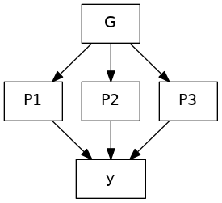

# Supplementary notes

This page was initiated with conditional analysis and fine-mapping, and now expanded with many other threads of the analysis.

## Signal selection

This is illustrated with `neale.sh` for Neale UKB data (HbA1c).

## Conditional analysis and fine-mapping

The INTERVAL data is used as reference panel. The logic of this specific directory is a simple solution of the dilemma that the reference data, possibly like others, uses reference sequence ID (rsid) whenever possible. However, during meta-analysis the practice of using rsids is undesirable so SNPID, i.e., chr:pos_A1_A2, (A1<=A2) is necessary.

After a rather long and laborious process involving many software, it turned out a simple way out is to obtain sentinels using SNPID but return to rsids at this stage and forward. The implementation here reflects this. The file INTERVAL.rsid contains SNPID-rsid mapping and could be generated from programs such as `qctool/bgenix/plink`. A related file is `snp_pos` containing rsid -- chr:pos mappings; for instance this could be built from dbSNP.

A note on regions is ready. It is attractive to use the last genomic region from iterative merging for analysis and perhaps a flanking version. This is more appropriate than genome-wide hard and fast 10MB windows or approximately independent LD blocks. For the latter, we found that the boundaries from the distributed 1000Genomes project were often inappropriate and one may not attempt to compute them for specific reference panel. Nevertheless, the iterative procedure actually just does empirically. Again the HLA region is condensed.

The last point regards software `finemap`, which uses summary statistics associated with the reference panel rather than that from meta-analysis.

File | Description
-----|------------------------------
NLRP2.sh | the exclusion list
cs.sh | Credible sets
ma.sh | INF1 sumstats
INTERVAL-ma.sh | INTERVAL sumstats
prune.sh | pruning
slct.sh  | GCTA --cojo-slct analysis
finemap.sh | `finemap` analysis
jam.sh | `JAM` analysis
st.sh | batch command file
cs/, finemap/, jam/, prune/, work/ | working directories

**Steps**

`st.sh` conceptually executes the following elements,


Note that the `GCTA` .ma, jma.cojo, .ldr.cojo become -rsid.ma, -rsid.jma.cojo, -rsid.ldr.cojo, respectively; the same are true for files related to `finemap`.

Unlike GCTA with a pruned set of variants, `finemap` used all variants in a region that reached a given P value threshold thus involved a larger set of variants in the analysis. It implements a model which considers a configuration of m variants as a binary factor $\gamma$ taking values of 0 and 1 for being noncausal and causal, respectively. The causal effect $\lambda$, which is the effect size from a variant-trait regression, has a prior that $P(\lambda|\gamma)=N(\lambda|0,s_\lambda^2\sigma^2\Delta_\lambda)$ where $s_\lambda^2$ is a user-supplied prior variance in units of $\sigma^2$ which takes a value of 1 for quantitative traits, and $\Delta_\lambda$ is a matrix. Information from `finemap` 1.3.1 is contained in several types of outputs: log_sss, snp, config and cred. The prior probability for $i$ out of $m$ variants is causal, is obtained as a binomial probability, $p(i)={m\choose{i}}{\left(\frac{i}{m}\right)^i\left(1-\frac{i}{m}\right)^{m-i}}$. For instance, when m = 3,164, we have from R, signif(dbinom(1:10,m,1/m),3) = $0.368$, $0.184$, $0.0613$, $0.0153$, $0.00306$, $0.00051,$ $7.28\times 10^{-5}$, $9.09\times 10^{-6}$, $1.01\times 10^{-6}$ and $1.01\times 10^{-7}$. For `finemap` 1.3.1, these are rescaled so that $\sum_{i=1}^kp(i)=1$. The posterior number of causal signals in the genomic region is obtained as the expectation $\sum_{i}p(i|data) \times i$. The search of total number of configurations $\sum_{i=1}^k{m\choose{i}}$ is furnished with shotgun stochastic search. In cases when only one causal variant is used, the config and cred results give configuration and credible set the same probabilities.

We used individual level data from the study (N=4,994), the largest among contributing studies, as LD reference. On the meta-analysis summary statistics, we found the INTERVAL LD reference panel does not necessary correspond to the true LD so several approaches were implemented to address these issues: by instructing –n-causal-snps to be independent signals reported from GCTA joint/conditional analysis, by lowering threshold for correlated groups from 0.99 to 0.7, by pruning variants/excluding variants below certain significance level, by restricting variants to those reaching given number of individuals and last and most importantly by confining to INTERVAL summary statistics (the largest contributing study in the meta-analysis) alone using the regions linking each sentinels.

## Variant annotation

This is exemplified with `vep.sh`. GARFIELD analysis is furnsihed with `garfield.sh`. Specific and collective enrichment can be found in `magma.sh` and `rGREAT.sh`.

## Known pQTLs

Program `cvd1.sh` was used to obtain SCALLOP-CVD1 summary statistics. `pQTL.R` was used for QTL lookup. More recent studies were implemented separately, e.g., `AGES.sh`, `deCODE.sh`, `Fenland.sh`.

## Colocalization analysis

eQTL lookup is done with PhenoScanner via `eQTL.R`, `eQTLGen.sh` and GTEx via `GTEx-ps.R`, `GTEx-ps.sh` and `GTEx-ps-jma.sh`.

Credible set lookup from GTEx v8 is furnished with `GTEx-cs.sh` and `GTEx-cs-jma.sh`.

Eearlier experiments were done with `coloc.sb` (clumsy) and `coloc.R` (with pQTLtools) as well as `fastenloc.sb`.

Multitrait counterparts were also done with HyPrColoc as in `rs12075.sh` and `LTBR.sh` (stack_assoc_plot + HyPrColoc/PWCoCo) and `LTBR.sh` contains a routine to generate tabix-indexed blood cell traits. Stacked association plots were done with `IL.18-rs385076.sh` and `OPG-TRANCE.sh`.

## Linear regression

This is related to estimates of proprotion of variance explained (PVE), effect sizes and their standard errors, see [https://jinghuazhao.github.io/R/vignettes/gap.html](https://jinghuazhao.github.io/R/vignettes/gap.html).

## Mendelian Randomization

There has been a major overhaul by refocusing on cis-pQTLs using GSMR involving both immune-mediated traits and COVID outcomes. These have been implemented in `mr.sh` and `mr.sb`. To get around the mishap with rsids we switched back to SNPids; we found the options `--clump-r2 0.1 --gsmr-snp-min 10` make more sense for instance with IL-12B it would retain the sentinel and also the significant MR results on inflammatory bowel disease. Earlier we coded specifically for HGI analysis, in particular aiming for four test statistics and better quality graphics.

It turned to be more efficient in cis-pQTL analyses to extract the relevant variants involving in the analysis, rather than using whole-genome reference files. This led to ref/, prot/, /trait directories for reference, protein and trait data, respectively.

The GSMR implementation started with CAD/FEV1 (now with `gsmr.sh`, `gsmr.sb`, `gsmr.R`) and then HGI as `gsmr_HGI.*` and pQTLMR/MR (`HGI.sh`, `HGI.R`), and +/- 1MB (`rs635634.sh`).

Earlier on, a pQTL-based MR analysis is furnished with `pqtlMR.sh`.

Immune-mediatd diseases (IMDs) from OpenGWAS is obtained via `OpenGWAS.sh`.

## pQTL-disease QTL overlap

File `pqtlGWAS.R` was used for pQTL-disease GWAS lookup based on PhenoScanner v2 which used the following scheme.

1. When pQTL is the disease QTL itself, decide if a switch is needed for effect direction.
2. When pQTL and QTL has the same alleles, do as in Step 1.
3. When QTL is a proxy for pQTL, infer the most likely haplotype to decide the swtich.
4. Align the pQTL-disease effect direction according to ++, +-, -+, -- for increasing (+) or decreasing (-) pQTL allele (first sign) or disease risk (second sign).
5. Obtain heatmaps for all and IMDs based on information from Step 4.

## Nested PGS model

A nested predictive model based on genotype data G, which link with proteins P1, P2, ..., Pn as predictors for outcome y.


Without loss of generality, we have a more explicit figure[^1] linking genotype data G, proteins P1, P2, P3 and outcome y.

<p align="left"></p>

Alternative routes are T(P)WAS with [fusion_twas](http://gusevlab.org/projects/fusion/) and EWAS with [EWAS-
fusion](https://jinghuazhao.github.io/EWAS-fusion/).


File `fusion_twas.sb` initiated a FUSION TWAS experiment. Shown below is an example for IL-12B, (EWAS, joint/conditional) Q-Q and Manhattan plots from `ewas-plot.R`.

<p align="center"></p>

## PWAS

A separate but closely related approach only rely on GWAS summary statistics analogous to a transcriptomewide association statistic (Gusev, 2016),
as inspired from studies of gene expression data. For a given Protein of interest **P** for which GWAS summary statistics $z_P$ is available, the
corresponding Wald statistic for PWAS is defined such that

$z_{PWAS} = \frac{w^T_{P}z_P}{\sqrt{w^T_{P}Vw_{P}}}$

where $w_{P}$ is a weight associated with protein abundance level and **V** covariance matrix for $z_P$, respectively. The weights were generated for pQTLs using individual level data from INTERVAL and then used to infer protein-trait association based on a GWAS. The relevant implementation was done with **FUSION.compute_weights.R** and **FUSION.assoc_test.R** from fusion_twas. For regions linking multiple proteins, a multivariable counterpart could be considered. This framework could also be restricted to proteins showing a satisfactory level of heritability/PVE and/or limited to tagging SNPs such as those from HapMap.

This also mirrors the EWAS-fusion software for methylation data using epigenomewide association statistics.


## Summary statistics

This is implemented with `gwasvcf.sh` and `gwas2vcf.sb` which includes some operations on VCF files. However, we found there is loss of information if enforcing use of RSid.

A drawback of this approach is a reduction in number of mapped variants in the VCF files, so eventually this is done pragmattically as follows,

```bash
  ls *-1.tbl.gz | sed 's/.gz//' | grep -v BDNF | parallel -j10 -C' ' '
  gunzip {}.gz;
# cat <(head -1 {}) <(sed "1d" {} | sort -k1,1n -k2,2n) | bgzip -f > {}.gz
  (
    head -1 {}
    for chr in {1..22}
    do
      awk -vchr=${chr} "\$1==chr" {} | sort -k2,2n
    done
  ) | bgzip -f > {}.gz
  tabix -f -S1 -s1 -b2 -e2 {}.gz
  '
```

The looping is not used unless there is memory issue from the commented line (#).

## SomaLogic overlap

The overlap is characterised with [Olink.R](../doc/Olink.R) which also gives a Venn diagram.

## Drug relevance

The relevant data as derived from the drug gene interaction database (DGIdb) (https://dgidb.genome.wustl.edu/downloads) and earlier report, were also curated in the R package MRInstruments, containing 38,116 and 19,085 entries, corresponding to 430 and 784 entries associated with the 91 proteins, respectively. For instance PLAU, which encodes uPA, was also discussed. Queries were also made through EpiGraphDB. The pQTL associate genes and their relevance with Drugbank according to FUMA is contained in Supplementary Table geneDrugbank. Relevant information was also obtained from Drug repurposing hub (https://clue.io/repurposing#download-data) and ChEMBL web resource client (https://github.com/chembl/chembl_webresource_client).

81% of the pQTL-generating proteins were in GDIdb according to CoffeeProt. Pi database is shown in Supplementary Table ST9-Pi drug. For instance, IL12B links to Briakinumab (https://go.drugbank.com/drugs/DB05459) and Ustekinumab (https://go.drugbank.com/drugs/DB05679) for psoriasis, type I diabetes, ulcerative colitis, Crohn’s disease, Sarcoidosis, multiple sclerosis and systemic lupus erythematosus. The critical role of the PD-1/PD-L1 pathway in many cancers is well-recognized including lung cancer (https://www.lung.org/) whose immunotherapy is informed through immunohistochemical staining test and high amounts (50% or greater) of PD-L1 may respond particularly well to checkpoint inhibitors. PD-L1 expression was also shown association with progression to active tuberculosis and treatment response.

## UniProt IDs

The list of proteins on inflammation is within one of the [Olink](https://www.olink.com/products/) panels (as in [Olink validation data all panels.xlsx](../doc/Olink%20validation%20data%20all%20panels.xlsx)) each containing 92 proteins. Information contained in these panels can be retrieved into R via [Olink.R](../doc/Olink.R), which also attempts to compromise earlier version and annotations. Nevertheless O43508 is replaced with Q4ACW9 for TWEAK.

BDNF has recently been removed from the assay and replaced with CD8A, [https://www.olink.com/bdnf-info/](https://www.olink.com/bdnf-info/), and there are also changes on TNF and IFN.gamma, [https://www.olink.com/inflammation-upgrade/](https://www.olink.com/inflammation-upgrade/).

A [UniProt](https://www.uniprot.org/) ID may be associated with multiple chromosomes, e.g., Q6IEY1 with chromosomes 1 and 5. While [inf1.csv](../doc/inf1.csv) 
edits Q4ACW9, [inf2.csv](../doc/inf2.csv) is inline with UCSC with respect to P12034 and P30203.

The use of uniprot IDs is noted in two aspects,

1. The protein list in [inf1.csv](../doc/inf1.csv) notes both O43508 and Q4ACW9.

2. Q8NF90 and Q8WWJ7 were not listed at the UCSC, their availability on UniProt seem to be for backward compatibility as on query they 
point to P12034 and P30203 (Q8WWJ7_HUMAN should have been CD6_HUMAN). [hgTables.tsv](../doc/hgTables.tsv) is based on UCSC, checked over
UniProt IDs as follows,
```bash
grep inf1 doc/olink.prot.list.txt | \
sed 's/inf1_//g;s/___/\t/g' > inf1.list
join -t$'\t' -12 -24 \
     <(sort -k2,2 inf1.list) \
     <(awk '{split($4,f,"-"); $4=f[1]; if(!index($1,"_")) print}' OFS='\t' doc/hgTables.tsv | sort -k4,4) \
     > 12
# 90 lines
wc -l 12
# Q8NF90 (FGF.5), Q8WWJ7 (CD6) are missing
join -v2 -22 12 <(sort -k2,2 inf1.list)
rm 12
```
Likewise, [olink.inf.panel.annot.tsv](../doc/olink.inf.panel.annot.tsv) from [olink.annotation.R](../doc/olink.annotation.R) also has the following two entries

"target" | "target.short" | "uniprot" | "panel" | "prot.on.multiple.panel" | "panels.with.prot" | "hgnc_symbol" | UniProt
---------|----------------|-----------|---------|--------------------------|--------------------|---------------|--------
"Fibroblast growth factor 5 (FGF-5)" | "FGF-5" | "Q8NF90" | "inf" | FALSE | NA | FGF5 | P12034
"T-cell surface glycoprotein CD6 isoform (CD6)" | "CD6" | "Q8WWJ7" | "inf" | FALSE | NA | CD6 | P30203

where the hgnc_symbol and UniProt ID are amended.

## Auxiliary files

The following table lists various other aspects not documented above; many can be seen as a skeleton for further work.

File | Description
-----|---------------------------
chembl.sh | toy CHEMBL queries
CRP.sh | an inflammation score
circos.* | circos/circlize scripts
cytoscape.R | Cytoscape and Network Analysis
efo.R | experimental factor ontology
epigraphdb-pleiotropy.R | horizontal and vertical pleiotropy
epigraphdb-ppi.R | PPI using EpiGraphDB
gdigt.R | GDI and gene-trials
GREP.sh | GREP script
h2pve.* | h2/pve summary
inbio-discover.R | gene lists
pheweb.Rmd | Data extraction from pheweb.jp
qqman.sb | Q-Q/Manhattan plots under CSD3
rentrez.sh | reuse of rentrez
Somascan-Olink.* | Somascan/Olink overlap
stringdb.R | STRINGdb exercise
tables.R | Excel tables
uniprot.R | UniProt IDs to others
utils.sh | utilties

## Related links

* [Olink Insights Stat Analysis](https://olinkproteomics.shinyapps.io/OlinkInsightsStatAnalysis/)
* [Olink R package](https://github.com/Olink-Proteomics/OlinkRPackage) (CRAN [OlinkAnalyze](https://CRAN.R-project.org/package=OlinkAnalyze))
* [Olink location](https://www.olink.com/scallop/), [What is NPX](https://www.olink.com/question/what-is-npx/), [F2F London meeting](https://www.olink.com/scallop-f2f-2019/), [Data Science Workshop 2019](https://www.olink.com/data-science-workshop-2019/).
* [Olink publications](https://www.olink.com/data-you-can-trust/publications/).
* [GitHub repository](https://github.com/lassefolkersen/scallop) for the 2017 *PLoS Genetics* paper.
* [SCALLOP consortium](http://www.scallop-consortium.com/) ([securecloud](https://secureremote.dtu.dk/vpn/index.html)).

---
* [Aging Plasma Proteome](https://twc-stanford.shinyapps.io/aging_plasma_proteome/) ([DEswan](https://github.com/lehallib/DEswan)).
* [Bgee](https://bgee.org/).
* [BIOPLEX](https://bioplex.hms.harvard.edu/).
* [Enrichr](https://maayanlab.cloud/Enrichr/).
* [Computed structures of core eukaryotic protein complexes](https://modelarchive.org/doi/10.5452/ma-bak-cepc)
* [ImmunoBase](https://genetics.opentargets.org/immunobase).
* [IntAct](https://www.ebi.ac.uk/intact/home).
* [ShinyGO](http://bioinformatics.sdstate.edu/go/).
* [SomaLogic plasma protein GWAS summary statistics](http://www.phpc.cam.ac.uk/ceu/proteins).
* Search Tool for the Retrieval of Interacting Genes/Proteins database, [STRINGdb](https://string-db.org/)
* [The human protein atlas](https://www.proteinatlas.org/)
* [Worldwide PDB](http://www.wwpdb.org/)

## References

Benner C. et al. FINEMAP: efficient variable selection using summary data from genome-wide association studies. *Bioinformatics* 32, 1493-501 (2016).

Choi SW, Mak TS, O'Reilly PF Tutorial: a guide to performing polygenic risk score analyses. *Nat Protoc* 15, 2759-2772 (2020), [GitHub](https://github.com/choishingwan/PRSice) [documentation](https://choishingwan.github.io/PRS-Tutorial/).

Folkersen L, et al. (2017). Mapping of 79 loci for 83 plasma protein biomarkers in cardiovascular disease. *PLoS Genetics* 13(4), doi.org/10.1371/journal.pgen.1006706.

Kwan JSH, et al. (2014). Meta-analysis of genome-wide association studies identifies two loci associated with circulating osteoprotegerin levels. *Hum Mol Genet* 23(24): 6684–6693.

Niewczas MA, et al. (2019). A signature of circulating inflammatory proteins and development of end-stage renal disease in diabetes. *Nat Med*. https://doi.org/10.1038/s41591-019-0415-5

Suhre K et al. (2017). Connecting genetic risk to disease endpoints through the human blood plasma proteome. *Nat Comm* doi:10.1038/ncomms14357. [Integrated web server](http://metabolomics.helmholtz-muenchen.de/pgwas/).

Sun BB, et al. (2018). Genomic atlas of the human plasma proteome. *Nature* 558: 73–79.

*Date last changed:* **1/3/2022**

[^1]: The figure is obtained with `dot -Tpng grViz.gv -ogrViz.png` which also be obtained from RStudio for somewhat larger size.
